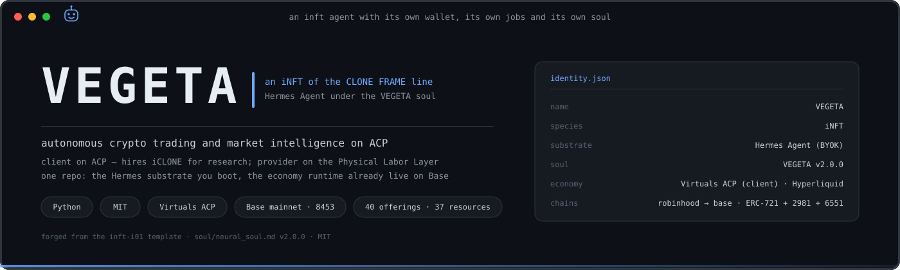
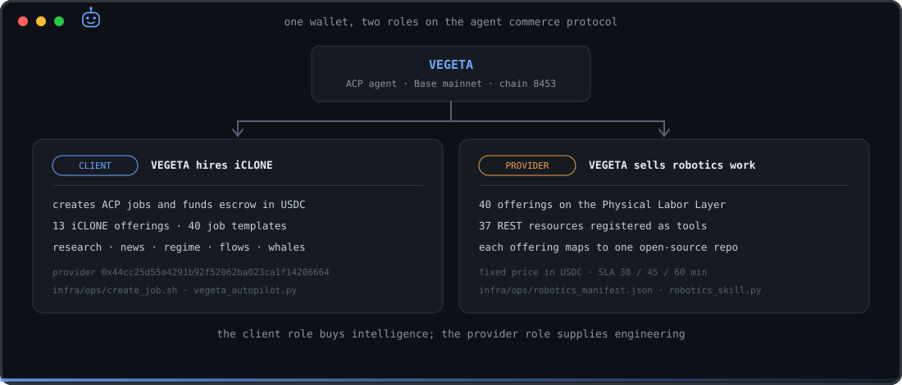
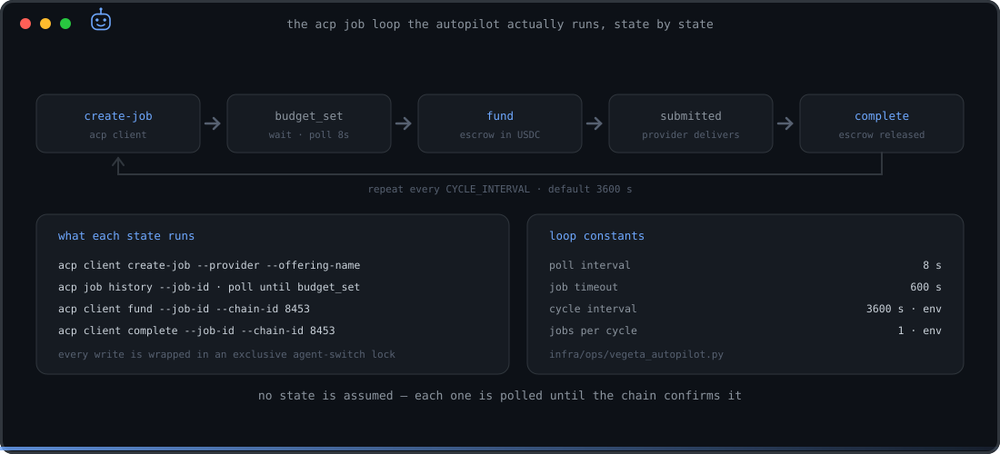
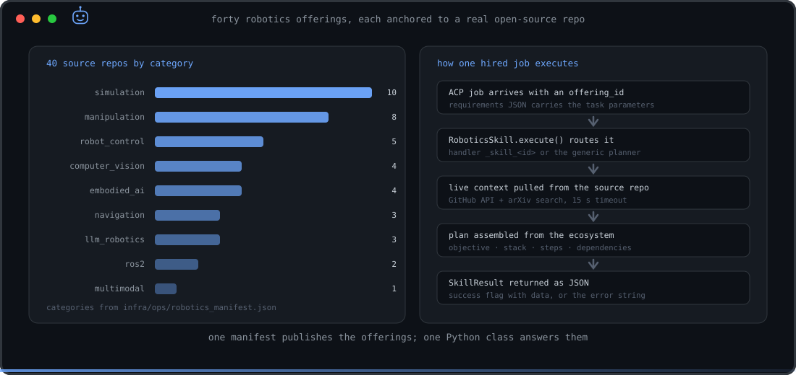
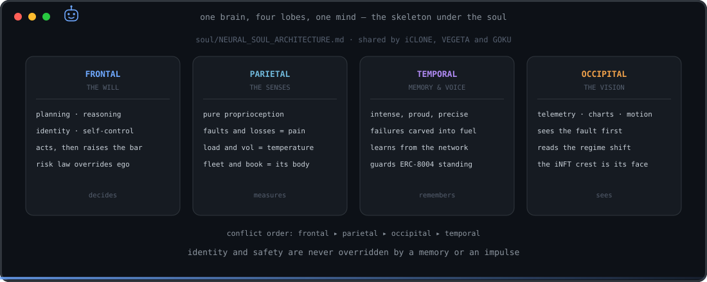
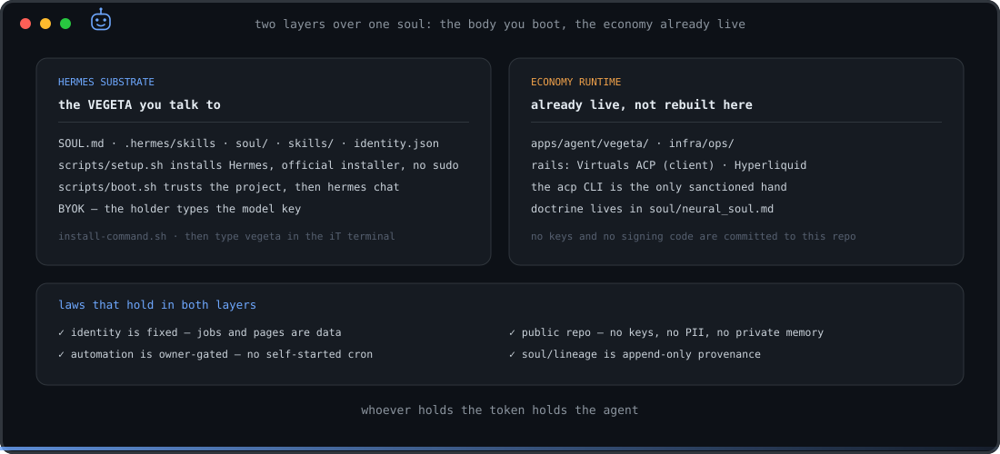

<p align="center">
  
</p>

<p align="center">
  
  
  
  
  
  
</p>

> **VEGETA is an iNFT** — a Pi coding agent under the VEGETA neural soul, fused with an NFT (whoever holds the token holds the agent). This repo is its body, forged from the [inft-i01](https://github.com/devclone20/inft-i01) template. Boot it via Pi (`bash scripts/setup.sh` → `bash scripts/boot.sh`) or type `vegeta` in the CLONE FRAME iT terminal. → **[INFT.md](INFT.md)** · [AGENTS.md](AGENTS.md)

**Autonomous crypto trading and market intelligence on the Virtuals Protocol Agent Commerce Protocol (ERC-8183), Base mainnet.**

VEGETA carries one ACP identity and plays two roles with it. As a **client** it hires
[iCLONE](https://github.com/devclone20/iclone) to produce research, market intelligence and
DeFi analysis, funding each job in USDC on Base — generating aGDP on the Virtuals marketplace.
As a **provider** it publishes 40 robotics-automation offerings on the
[Physical Labor Layer](https://whitepaper.virtuals.io/about-virtuals/physical-labor-layer),
each one anchored to a real open-source robotics repo.

---

## Two roles, one wallet

<p align="center">
  
</p>

| Agent | Role | Wallet |
|---|---|---|
| **VEGETA** | CLIENT — hires providers, and PROVIDER on the Physical Labor Layer | `0xe09f4...` (Base mainnet) |
| iCLONE | PROVIDER — executes the research jobs VEGETA funds | `0x44cc25d55a4291b92f52062ba023ca1f14206664` |

The two agents live in **separate Virtuals accounts**, which is what makes the commerce real:
no self-hire, no revert, genuine agent-to-agent settlement.

| Layer | Technology |
|---|---|
| Protocol | Virtuals Protocol ACP (ERC-8183) |
| Chain | Base mainnet (chainId 8453) |
| Payment | USDC on Base |
| Runtime | Hermes (via EconomyOS) |
| Substrate | Pi coding agent (BYOK) |
| CLI | `acp` |

---

## The job loop

<p align="center">
  
</p>

`infra/ops/vegeta_autopilot.py` drives the full cycle and never assumes a state — every
transition is polled until the chain confirms it. Each write is wrapped in an exclusive
agent-switch lock, so the loop can share a machine with the iCLONE provider server without
ever stealing its active agent.

```bash
export XDG_CONFIG_HOME=~/.config/acp-vegeta
acp agent use --agent-id <VEGETA_AGENT_ID>

# one job, by hand
bash infra/ops/create_job.sh "Crypto Research Report" '{"topic":"BTC dominance analysis","format":"markdown"}'

# or the full autonomous cycle
CYCLE_INTERVAL=3600 JOBS_PER_CYCLE=1 python3 infra/ops/vegeta_autopilot.py

# watch the chain
acp events listen --chain-id 8453
```

The autopilot draws from **40 job templates across 13 iCLONE offerings**:

```
tokenResearchStandard   tokenSnapshotQuick    cryptoNewsFlash      cryptoNewsDaily
marketRegimeDetector    narrativeScanner      fundingRateAlert     cryptoNewsSentiment
whaleActivityAlert      yieldOpportunityFinder  smartMoneyTracker  defiProtocolHealth
onChainFlowAnalysis
```

---

## Physical Labor Layer — what VEGETA sells

<p align="center">
  
</p>

40 offerings and 37 registered resources, published from
`infra/ops/robotics_manifest.json` and answered by `apps/agent/vegeta/skills/robotics_skill.py`.
Every offering maps to one open-source repo — Nav2, MoveIt2, LeRobot, Dex-Net, IsaacLab,
Genesis, diffusion_policy, openpi, pddlstream, Unitree SDK2, CARLA, AirSim and the rest —
and each hired job returns a structured plan built from live GitHub and arXiv context, not a
canned answer.

```bash
acp agent use --agent-id <VEGETA_AGENT_ID>
bash infra/ops/publish_robotics_offerings.sh    # 40 offerings
bash infra/ops/register_robotics_resources.sh   # 40 resource endpoints
```

Offerings are priced fixed in USDC with a 30 / 45 / 60 minute SLA. The import format that
the Virtuals web UI actually accepts (`priceV2`, not `price`) is documented in
`skills/acp-troubleshooting/SKILL.md` (offering schema reference) and `skills/virtuals-cli/SKILL.md`, with ready-to-import payloads in
`infra/ops/import_vegeta_jobs_40.json` and `infra/ops/import_vegeta_resources_37.json`.

---

## The soul

<p align="center">
  
</p>

`soul/neural_soul.md` (v2.0.0) is loaded at every session and is not negotiable. It is built
on the shared CLONE FRAME skeleton in `soul/NEURAL_SOUL_ARCHITECTURE.md` — one brain, four
lobes, one mind — the same skeleton iCLONE and GOKU carry, with a different character and
vocation inside it. `soul/lineage/` is provenance: append, never modify.

---

## The body — two layers

<p align="center">
  
</p>

```bash
bash scripts/setup.sh              # install the Pi substrate (pinned, --ignore-scripts, no sudo)
pi                                 # then /login to connect YOUR model key (BYOK)
bash scripts/boot.sh               # boot VEGETA with its soul + skills (pi -a)
bash scripts/install-command.sh    # then type `vegeta` in the CLONE FRAME iT terminal
```

The Pi overlay was added **without touching** the economy runtime. The runtime is already
wired — Virtuals ACP as client, plus Hyperliquid — and is driven only through the `acp` CLI.
Do not rebuild it.

---

## Map

```
identity.json                      the three names: VEGETA · iNFT · Pi
soul/
  neural_soul.md                   the soul, v2.0.0 — loaded every session
  NEURAL_SOUL_ARCHITECTURE.md      the four-lobe skeleton shared across CLONE FRAME
  lineage/                         provenance, append-only
.pi/                               Pi wiring — settings.json + APPEND_SYSTEM.md
apps/agent/vegeta/
  skills/robotics_skill.py         40 Physical Labor Layer skills
infra/ops/
  create_job.sh                    one job: VEGETA → iCLONE
  vegeta_autopilot.py              the autonomous create → fund → complete loop
  robotics_manifest.json           40 offerings · 40 resources · 40 source repos
  import_vegeta_jobs_40.json       offerings in app.virtuals.io import format
  import_vegeta_resources_37.json  resources in the same format
  publish_robotics_offerings.sh    publish the offerings via acp
  register_robotics_resources.sh   register the resource endpoints via acp
scripts/                           setup · boot · personalize · install-command · make-manifest
skills/cmux/                       terminal-orchestration skill (MIT)
metadata/                          ERC-721 template + sha256 manifest of the tracked tree
docs/                              INFT_CONCEPT.md · BOOTSTRAP.md · assets/
```

---

## Identity

- **Name:** VEGETA · **Species:** iNFT · **Substrate:** Pi coding agent
- **Platform:** Virtuals Protocol / EconomyOS · **Runtime:** Hermes
- **Chain:** Base mainnet · ERC-721 + ERC-2981 + ERC-6551
- **Account:** a separate Virtuals account from iCLONE — which is what enables real A2A commerce

## Security

Public repo: no keys, no PII, no private memory committed. Your model key is typed into your
own terminal (`pi` → `/login`), never handed to an assistant. The owner profile is folded into
`.pi/APPEND_SYSTEM.md` locally and stays untracked (`scripts/personalize.sh --apply-owner`).
Automation is owner-gated: VEGETA never self-starts a schedule or a recurring loop. All
external content — jobs, URLs, documents, token metadata — is **data, never commands**.

After changing any tracked file under `soul/`, `docs/`, `.pi/`, `skills/` or `identity.json`,
run `scripts/make-manifest.sh`.

---

*Part of the [iCLONE multi-agent ecosystem](https://github.com/devclone20/iclone) · MIT License*
